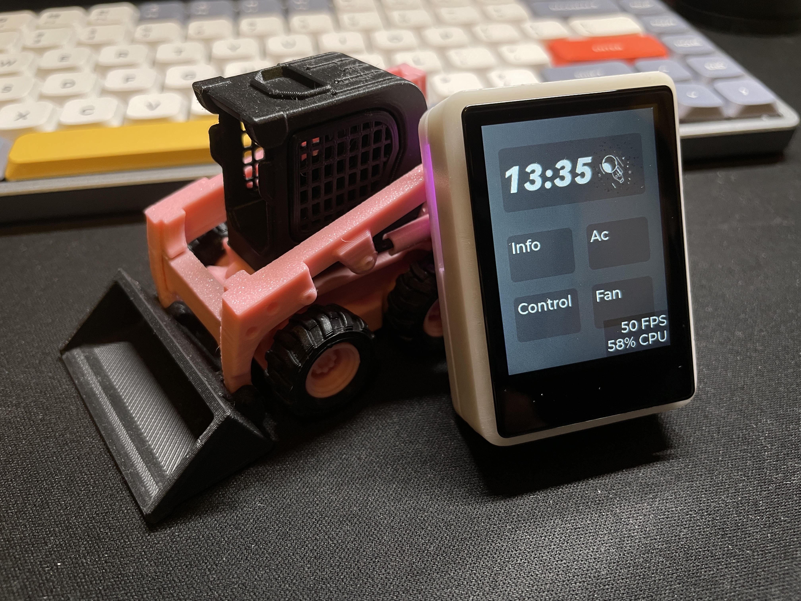
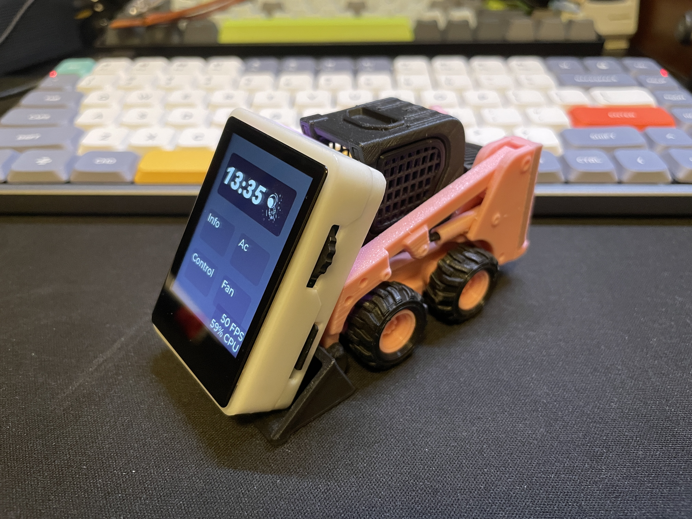

# exS3

> - 为学习ESP32 S3和LVGL而设计的软硬件项目
> - 尺寸迷你，包含3D外壳约40×60×18mm
>
> - 自制4层PCB，模块剩余引脚已全部引出，具备一定外设扩展性
> - 基于ESP-IDF 4.4.2 开发框架，手撸纯C

## 硬件信息

- MCU：ESP32 S3 N8R8
- 屏幕：2.0inch ST7789 SPI接口，分辨率240×320
- 存储：8Mb Flash + 外置SD Card
- 输入设备：按键（GPIO0）+ 旋转编码器 + FT62x6电容触摸
- 电池：3.7V锂电池 100mA 301525（该版3D外壳可用的最大尺寸）
- 指示：LED + DET402/震动马达
- 陀螺仪：MPU6050
- 电源管理：AXP173
- 

## 图片演示

## 致谢

